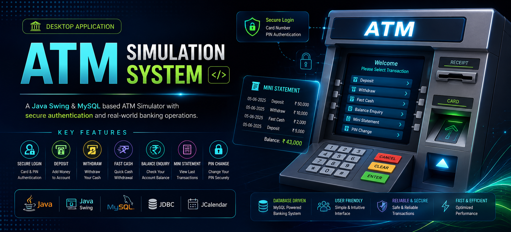
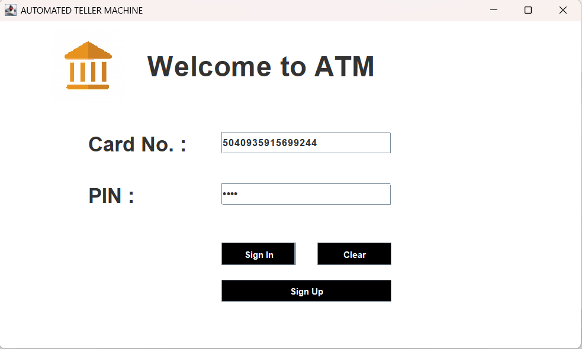
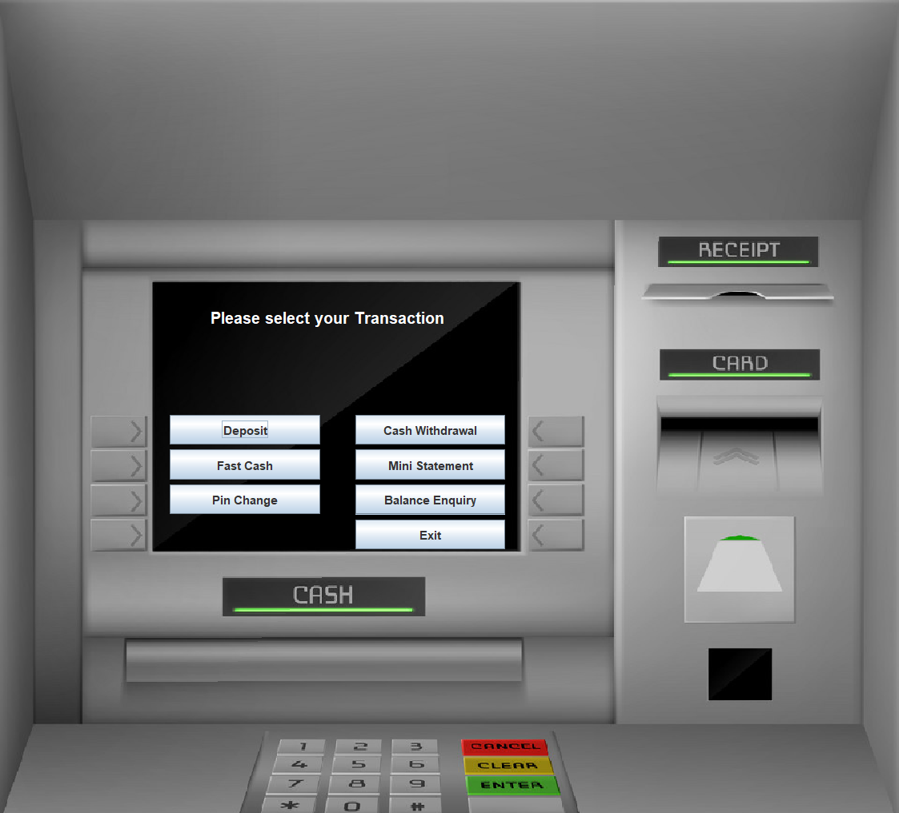
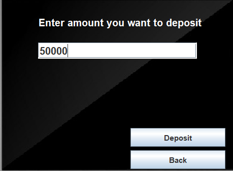
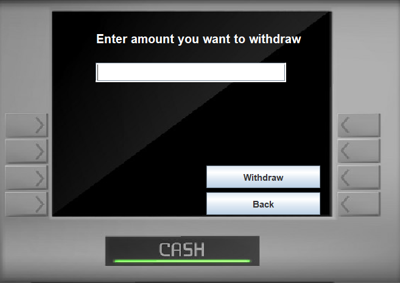
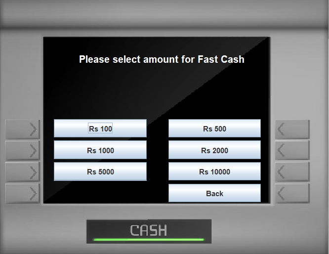
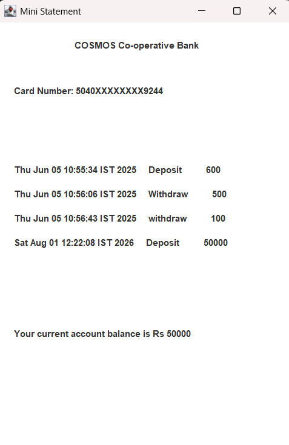

<p align="center">
  
</p>

<h1 align="center">🏧 ATM Simulation System</h1>

<p align="center">
A desktop-based ATM Simulation System developed using <b>Java Swing</b>, <b>JDBC</b>, and <b>MySQL</b> that replicates core banking operations including secure authentication, deposits, withdrawals, balance inquiry, PIN management, and transaction history.
</p>

<p align="center">


</p>

---

# 📖 About The Project

The **ATM Simulation System** is a desktop application developed using **Java Swing**, **JDBC**, and **MySQL** that simulates the working of an Automated Teller Machine.

The project provides a secure login mechanism using **Card Number** and **PIN**, allowing users to perform common banking operations through an intuitive graphical interface. All transactions are stored in a MySQL database to ensure persistent storage and transaction history.

The project demonstrates Java GUI development, database connectivity, authentication, object-oriented programming, and CRUD operations in a practical banking scenario.

---

# ✨ Features

## 🔐 Authentication

- Secure Login
- Card Number Verification
- PIN Authentication
- New Account Registration

---

## 💰 Banking Operations

- Deposit Money
- Withdraw Money
- Fast Cash
- Balance Enquiry
- PIN Change
- Mini Statement

---

## 🗄 Database

- MySQL Integration
- Persistent Transaction Storage
- JDBC Connectivity
- Transaction History

---

## 🖥 User Interface

- ATM-inspired graphical interface
- Interactive buttons
- User-friendly workflow
- Desktop application

---

# 📸 Screenshots

| Login | ATM Interface |
|--------|---------------|
|  |  |

| Deposit | Withdraw |
|----------|-----------|
|  |  |

| Fast Cash | Mini Statement |
|------------|----------------|
|  |  |

---

# 📑 Table of Contents

- About
- Features
- Tech Stack
- Modules
- Project Architecture
- Database
- Folder Structure
- Installation
- Database Setup
- Usage
- Future Enhancements
- Contributing
- License
- Author

---

# 🛠 Tech Stack

| Technology | Purpose |
|------------|----------|
| Java | Application Development |
| Java Swing | GUI |
| JDBC | Database Connectivity |
| MySQL | Database |
| JCalendar | Date Selection |

---

# 🧩 Modules

### 👤 Authentication

- Login
- Signup
- Account Creation

---

### 💳 Banking

- Deposit
- Withdraw
- Fast Cash
- Balance Enquiry
- PIN Change
- Mini Statement

---

### 🗄 Database

- Customer Information
- Login Credentials
- Transaction Records

---

# 🏗 Project Architecture

```text
                  User

                    │

                    ▼

              Java Swing GUI

                    │

                    ▼

          Banking Operations

                    │

                    ▼

                 JDBC Driver

                    │

                    ▼

             MySQL Database
```

---

# 🗄 Database

The project uses **MySQL**.

### Database Tables

| Table | Description |
|--------|-------------|
| signup | Customer Personal Details |
| signupTwo | Additional Customer Details |
| signupThree | Account Information |
| login | Login Credentials |
| bank | Banking Transactions |

Database script:

```text
database/
└── bankmanagementsystem.sql
```

---

# 📂 Project Structure

```text
ATM-Simulator-System
│
├── assets
│   ├── banner
│   └── screenshots
│
├── database
│   └── bankmanagementsystem.sql
│
├── lib
│   ├── mysql-connector-java-8.0.28.jar
│   └── jcalendar-tz-1.3.3-4.jar
│
├── src
│   ├── Login.java
│   ├── Deposit.java
│   ├── Withdraw.java
│   ├── FastCash.java
│   ├── BalanceEnquiry.java
│   ├── MiniStatement.java
│   ├── PinChange.java
│   ├── Transactions.java
│   ├── SignupOne.java
│   ├── SignupTwo.java
│   ├── SignupThree.java
│   ├── Conn.java
│   └── icons/
│
└── README.md
```

---

# 🚀 Getting Started

## Clone Repository

```bash
git clone https://github.com/TanmayT134/ATM-Simulation-System-using-Java.git
```

---

## Open Project

Import the project into:

- Eclipse IDE
- IntelliJ IDEA
- VS Code

---

# ⚙ Database Setup

1. Install MySQL.

2. Create database

```sql
CREATE DATABASE bankmanagementsystem;
```

3. Import

```text
database/bankmanagementsystem.sql
```

4. Update database credentials inside

```text
src/Conn.java
```

5. Run Login.java

---

# ▶ Usage

1. Create a new account.
2. Login using Card Number and PIN.
3. Select a banking operation.
4. Perform transactions.
5. View transaction history.
6. Exit the application.

---

# 🚀 Future Enhancements

- Online Fund Transfer
- QR Code Payments
- Email Notifications
- SMS Alerts
- ATM Receipt Generation
- Admin Dashboard
- Interest Calculation
- Multi-language Support
- Mobile Banking Integration
- Cloud Database Support

---

# 🤝 Contributing

Contributions are welcome.

1. Fork the repository.

2. Create a feature branch.

3. Commit your changes.

4. Push the branch.

5. Open a Pull Request.

---

# 👨‍💻 Author

**Tanmay Tawade**

If you found this project useful, consider giving it a ⭐.

---

<div align="center">

### ⭐ Star this repository if you found it useful!

Made with ❤️ by **Tanmay Tawade**

</div>
